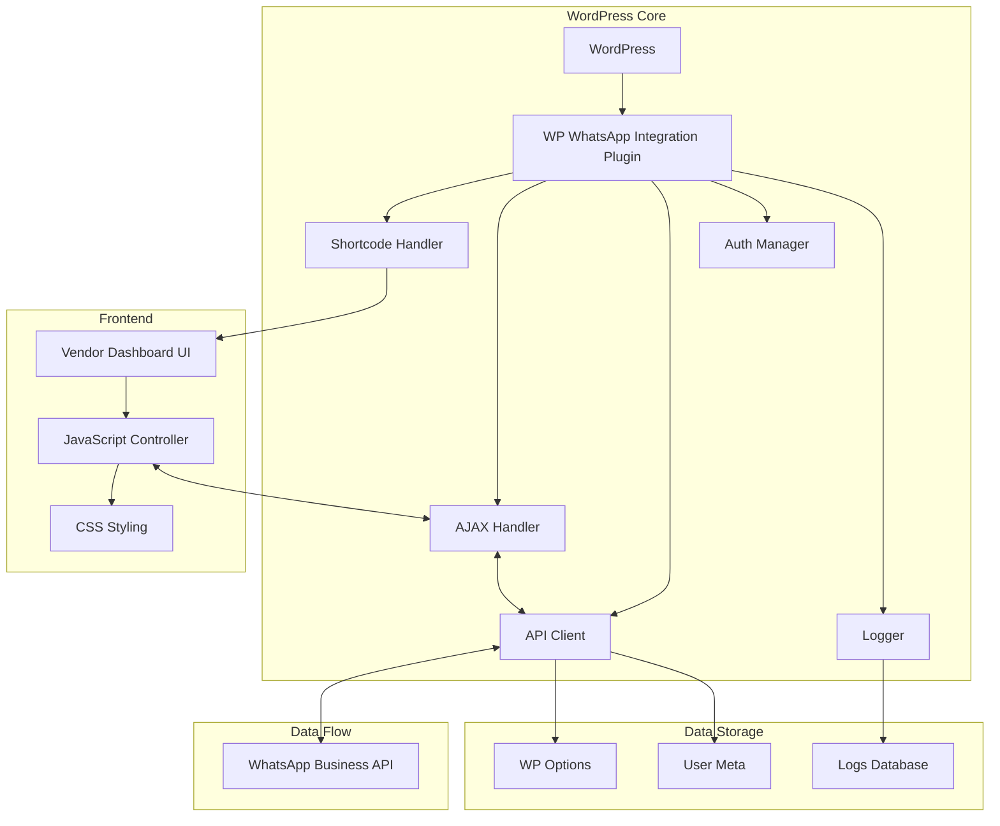
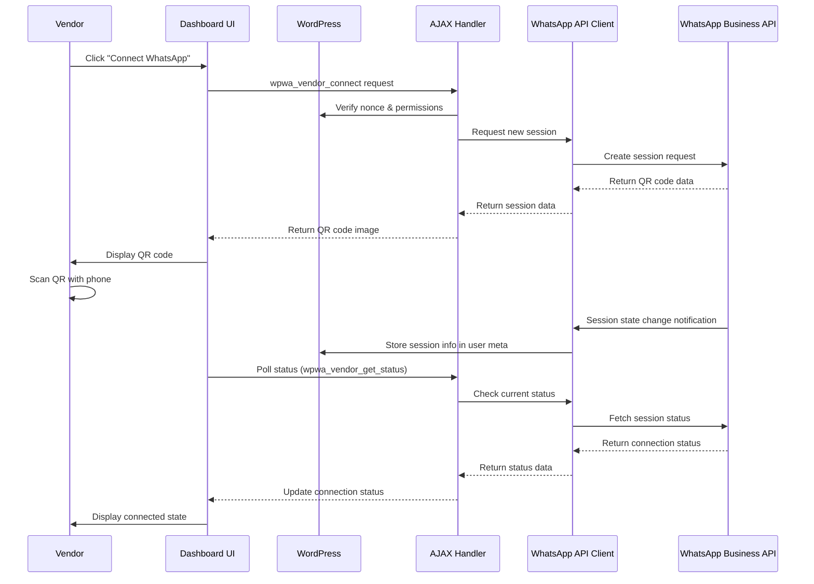
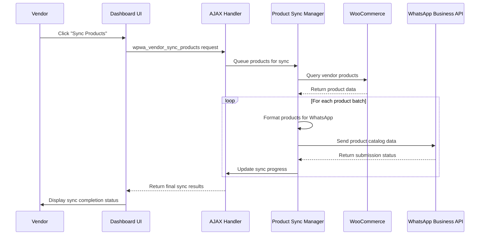

# WhatsApp Vendor Dashboard Technical Specifications

## System Architecture

The WhatsApp Vendor Dashboard is built using a modular architecture that separates concerns between shortcode rendering, AJAX handling, frontend interactions, and API communications.

### Component Diagram



## Core Components

### 1. WPWA_Vendor_Dashboard_Shortcode

**Responsibility**: Renders the vendor dashboard interface when the shortcode `[wpwa_vendor_dashboard]` is used.

**Key Methods**:

- `register_shortcode()`: Registers the shortcode with WordPress
- `render_vendor_dashboard($atts)`: Processes attributes and renders the dashboard
- `enqueue_assets()`: Loads required CSS and JavaScript files
- `get_current_vendor_id()`: Determines the current vendor's user ID
- `current_user_can_access()`: Checks if the current user has permission to access the dashboard

**File**: `/wp-whatsapp-integration/includes/class-wpwa-vendor-dashboard-shortcode.php`

### 2. WPWA_Vendor_Dashboard_AJAX

**Responsibility**: Processes AJAX requests from the vendor dashboard.

**Key Methods**:

- `get_vendor_status()`: Retrieves WhatsApp connection status for a vendor
- `connect_vendor_account()`: Initiates WhatsApp connection process
- `disconnect_vendor_account()`: Terminates WhatsApp connection
- `sync_vendor_products()`: Synchronizes products with WhatsApp catalog
- `toggle_vendor_integration()`: Enables/disables WhatsApp integration
- `get_vendor_logs()`: Retrieves activity logs for a vendor

**File**: `/wp-whatsapp-integration/includes/class-wpwa-vendor-dashboard-ajax.php`

### 3. vendor-dashboard-frontend.js

**Responsibility**: Handles user interactions and AJAX communications in the dashboard.

**Key Functions**:

- `init()`: Initializes the dashboard UI
- `fetchStatus()`: Retrieves current WhatsApp connection status
- `connectWhatsApp()`: Initiates connection process and handles QR code display
- `disconnectWhatsApp()`: Handles disconnection actions
- `syncProducts()`: Initiates product synchronization
- `pollStatus()`: Periodically checks connection status
- `displayLogs()`: Displays activity logs

**File**: `/wp-whatsapp-integration/assets/js/vendor-dashboard-frontend.js`

### 4. vendor-dashboard-frontend.css

**Responsibility**: Styles the vendor dashboard interface.

**Key Components**:

- Dashboard layout and responsive design
- Panel and section styling
- Status indicators and colors
- Button and control styling
- QR code display formatting
- Activity log presentation

**File**: `/wp-whatsapp-integration/assets/css/vendor-dashboard-frontend.css`

## Data Flow

### Connection Process



### Product Synchronization



## Data Storage

### User Meta

- `wpwa_vendor_session`: Stores the vendor's WhatsApp session information
- `wpwa_vendor_status`: Tracks the connection status (connected, disconnected, etc.)
- `wpwa_vendor_whatsapp_enabled`: Boolean flag for WhatsApp integration toggle
- `wpwa_vendor_last_sync`: Timestamp of the last successful product sync
- `wpwa_vendor_sync_stats`: Counts of total, successful, and failed product syncs

### Options

- `wpwa_allowed_vendor_roles`: Array of user roles that can access the vendor dashboard
- `wpwa_vendor_dashboard_options`: Global settings for the vendor dashboard

### Custom Tables

**wpwa_logs**

| Column | Type | Description |
|--------|------|-------------|
| id | bigint(20) | Auto-incremented primary key |
| user_id | bigint(20) | User/vendor ID |
| log_time | datetime | Timestamp of the event |
| log_type | varchar(50) | Event type (connection, sync, etc.) |
| log_message | text | Event description |
| log_data | longtext | JSON-encoded additional data |
| log_status | varchar(20) | Status (success, warning, error, info) |

## Security Implementation

### Access Control

1. **Role-Based Access**:
   ```php
   /**
    * Check if current user can access vendor dashboard
    */
   private function current_user_can_access() {
       // Get allowed vendor roles
       $allowed_roles = apply_filters('wpwa_allowed_vendor_roles', array(
           'shop_vendor',
           'vendor',
           'wcfm_vendor',
           'dc_vendor',
           'seller'
       ));
       
       // Check if user has any allowed role
       $user = wp_get_current_user();
       $can_access = false;
       
       foreach ($allowed_roles as $role) {
           if (in_array($role, (array) $user->roles)) {
               $can_access = true;
               break;
           }
       }
       
       // Allow override via filter
       return apply_filters('wpwa_vendor_can_access_dashboard', $can_access, $user->ID);
   }
   ```

2. **Nonce Verification**:
   ```php
   /**
    * Verify AJAX nonce
    */
   private function verify_ajax_nonce($nonce_key) {
       if (!isset($_POST['nonce']) || !wp_verify_nonce($_POST['nonce'], $nonce_key)) {
           wp_send_json_error(array(
               'message' => __('Security check failed', 'wp-whatsapp-api')
           ));
       }
   }
   ```

3. **Vendor Data Isolation**:
   ```php
   /**
    * Get vendor ID for current user or admin-specified vendor
    */
   public static function get_current_vendor_id() {
       // Allow admins to view specific vendor dashboard
       if (current_user_can('manage_options') && isset($_GET['vendor_id'])) {
           return absint($_GET['vendor_id']);
       }
       
       // Otherwise return current user ID
       return get_current_user_id();
   }
   ```

## Performance Considerations

### Caching

The vendor dashboard implements several caching strategies:

1. **Connection Status Caching**:
   - Status is cached in user meta to reduce API calls
   - Transients store temporary status with expiration

2. **Product Sync Optimization**:
   - Products are processed in batches of 50
   - Asynchronous processing for large catalogs via background jobs

3. **Session Management**:
   - WhatsApp sessions are maintained server-side
   - Polling interval adjusts based on connection state (more frequent while connecting, less frequent when stable)

## Extension Points

### Filters

| Filter Name | Description | Parameters |
|-------------|-------------|------------|
| `wpwa_allowed_vendor_roles` | Customize which user roles can access the vendor dashboard | `$roles` (array) |
| `wpwa_vendor_can_access_dashboard` | Fine-grained control over dashboard access | `$can_access` (bool), `$user_id` (int) |
| `wpwa_vendor_dashboard_template` | Override the dashboard template path | `$template_path` (string) |
| `wpwa_vendor_dashboard_assets_url` | Modify the URL for dashboard assets | `$assets_url` (string) |
| `wpwa_vendor_sync_batch_size` | Adjust the number of products processed per batch | `$batch_size` (int) |
| `wpwa_vendor_qrcode_lifetime` | Set QR code expiration time in seconds | `$lifetime` (int) |
| `wpwa_vendor_polling_interval` | Control status polling frequency | `$interval` (int) |
| `wpwa_vendor_logs_per_page` | Set number of log entries to display | `$per_page` (int) |

### Actions

| Action Name | Description | Parameters |
|------------|-------------|------------|
| `wpwa_vendor_before_dashboard` | Fires before dashboard output | `$vendor_id` (int) |
| `wpwa_vendor_after_dashboard` | Fires after dashboard output | `$vendor_id` (int) |
| `wpwa_vendor_dashboard_before_connection` | Before connection panel | `$vendor_id` (int) |
| `wpwa_vendor_dashboard_after_connection` | After connection panel | `$vendor_id` (int) |
| `wpwa_vendor_dashboard_before_products` | Before product sync panel | `$vendor_id` (int) |
| `wpwa_vendor_dashboard_after_products` | After product sync panel | `$vendor_id` (int) |
| `wpwa_vendor_dashboard_before_settings` | Before settings panel | `$vendor_id` (int) |
| `wpwa_vendor_dashboard_after_settings` | After settings panel | `$vendor_id` (int) |
| `wpwa_vendor_dashboard_before_logs` | Before logs panel | `$vendor_id` (int) |
| `wpwa_vendor_dashboard_after_logs` | After logs panel | `$vendor_id` (int) |
| `wpwa_vendor_whatsapp_connected` | When vendor connects WhatsApp | `$vendor_id` (int), `$session_id` (string) |
| `wpwa_vendor_whatsapp_disconnected` | When vendor disconnects WhatsApp | `$vendor_id` (int) |
| `wpwa_vendor_products_sync_started` | When product sync begins | `$vendor_id` (int), `$product_count` (int) |
| `wpwa_vendor_products_synced` | When product sync completes | `$vendor_id` (int), `$product_ids` (array), `$success` (bool) |
| `wpwa_vendor_integration_toggled` | When integration is enabled/disabled | `$vendor_id` (int), `$enabled` (bool) |

## Testing Strategy

The vendor dashboard components are tested using the following strategies:

1. **Unit Tests**:
   - Test individual methods in isolation
   - Focus on data transformation and validation logic

2. **Integration Tests**:
   - Test interactions between components
   - Mock WhatsApp API responses

3. **End-to-End Tests**:
   - Test the complete user flow
   - Validate UI rendering and AJAX interactions

4. **Security Tests**:
   - Test access controls and nonce verification
   - Validate data sanitization and escaping

## Compatibility

The vendor dashboard is compatible with:

- WordPress 5.6+ and WooCommerce 4.0+
- Major multivendor plugins:
  - WCFM Marketplace
  - Dokan
  - WC Vendors
  - WooCommerce Product Vendors

## Conclusion

The WhatsApp Vendor Dashboard provides a comprehensive solution for vendors in a multivendor marketplace to manage their WhatsApp integration. The modular architecture allows for easy extension and customization while maintaining security and performance.

Developers can leverage the documented extension points to add custom functionality or integrate with other systems as needed.