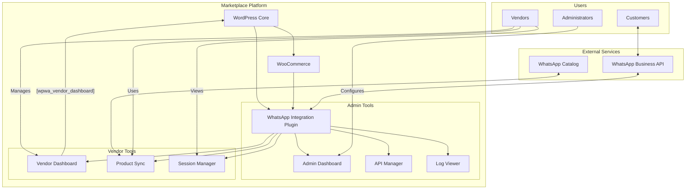
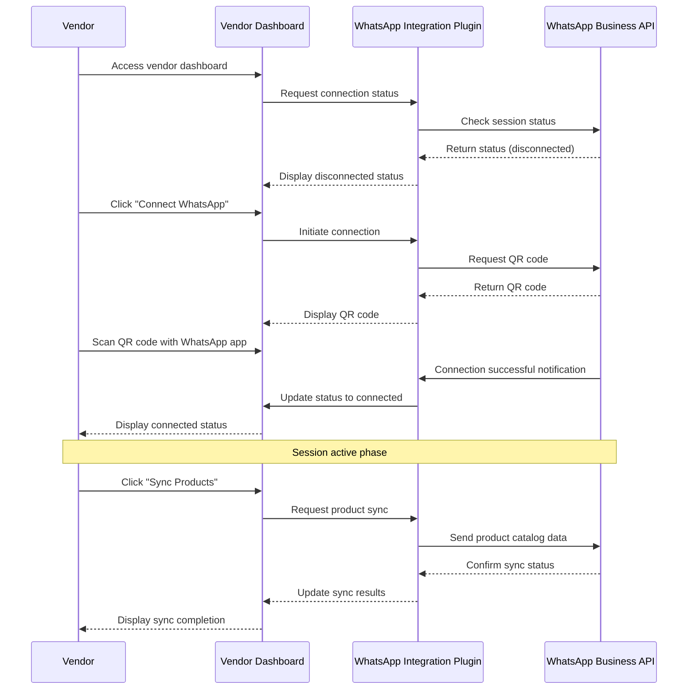

# WhatsApp Integration Ecosystem for Marketplace Vendors

## Introduction

This guide provides a comprehensive overview of how the WhatsApp Integration system works within a multivendor marketplace ecosystem, with a specific focus on the new vendor dashboard functionality.

## System Overview

The WhatsApp Integration for WooCommerce plugin creates a complete communication ecosystem between vendors, customers, and the marketplace platform:



## Key Components

### 1. WhatsApp API Integration

The core of the system connects your WordPress marketplace to the WhatsApp Business API, allowing for:

- Multi-vendor session management
- Message routing to appropriate vendors
- Product catalog synchronization
- Automated messaging workflows

### 2. Vendor Dashboard

The new `[wpwa_vendor_dashboard]` shortcode provides vendors with their own interface for:

- Managing their WhatsApp connection
- Synchronizing their products to WhatsApp catalog
- Configuring messaging preferences
- Viewing activity logs

### 3. Core Plugin Administration

The main plugin provides marketplace administrators with tools for:

- Platform-wide configuration
- API credentials management
- System monitoring and logging
- Multi-vendor oversight

## Integration Models

### Model 1: Centralized API, Distributed Management

In this model, the marketplace manages a single WhatsApp Business API connection, but individual vendors manage their own WhatsApp sessions:

- **Benefits**: Simplified API management, centralized billing, consistent experiences
- **Use Case**: Larger marketplaces with moderate vendor counts
- **Implementation**: Use the main admin panel for API configuration and the `[wpwa_vendor_dashboard]` shortcode for vendor self-service

### Model 2: Multi-Account API

In this model, each vendor has their own WhatsApp Business API account, connected through the marketplace:

- **Benefits**: Complete isolation between vendors, higher message limits per vendor
- **Use Case**: Enterprise marketplaces with high-volume vendors
- **Implementation**: Configure multiple API connections in the admin panel and assign to vendors

## WhatsApp Session Lifecycle



## Product Synchronization Flow

The product synchronization process connects vendor products to the WhatsApp catalog:

1. **Initialization**: Vendor requests product sync from dashboard
2. **Product Collection**: Plugin gathers all active vendor products
3. **Transformation**: Products are formatted to meet WhatsApp catalog requirements
4. **API Submission**: Formatted products sent to WhatsApp Business API
5. **Catalog Integration**: WhatsApp processes and adds products to catalog
6. **Status Update**: Results returned to vendor dashboard

## Customer Messaging Flow

When customers interact with vendors through WhatsApp:

1. Customer sends message to marketplace WhatsApp number
2. Plugin routes message to appropriate vendor based on context
3. Vendor receives notification of new message
4. Vendor responds through WhatsApp Business application
5. Customer receives response from vendor

## Best Practices for Vendors

### Connection Management

- **Maintain Active Connection**: Log in regularly to keep your WhatsApp session active
- **Dedicated Device**: Consider using a dedicated device/browser for WhatsApp Web
- **Monitor Connection Status**: Check your dashboard regularly to verify connection status

### Product Management

- **Regular Synchronization**: Sync your products weekly at minimum
- **Complete Product Information**: Ensure products have all required information before syncing
- **Image Quality**: Use high-quality product images that meet WhatsApp requirements
- **Product Descriptions**: Write clear, concise descriptions that work well in messaging

### Customer Communication

- **Timely Responses**: Aim to respond to customer inquiries within 24 hours
- **Professional Tone**: Maintain a consistent professional tone in all communications
- **Message Templates**: Use approved message templates for marketing communications
- **Conversation Management**: Use labels and folders to organize customer conversations

## Administrator Configuration

Marketplace administrators can configure the vendor dashboard through several methods:

1. **Direct Integration**: Create a dedicated page with the `[wpwa_vendor_dashboard]` shortcode
2. **Framework Integration**: Embed the vendor dashboard into existing marketplace frameworks using iframe or template inclusion
3. **Custom Access Control**: Implement additional access restrictions beyond the default role-based controls

### Configuration Examples

#### Basic Integration

```php
// Create a new page with the vendor dashboard shortcode
function create_whatsapp_vendor_page() {
    $page_id = wp_insert_post([
        'post_title'    => 'WhatsApp Management',
        'post_content'  => '[wpwa_vendor_dashboard]',
        'post_status'   => 'publish',
        'post_type'     => 'page',
    ]);
    
    return $page_id;
}
```

#### WCFM Integration

```php
// Add WhatsApp tab to WCFM vendor dashboard
function add_wcfm_whatsapp_tab($tabs) {
    $tabs['whatsapp'] = [
        'label' => 'WhatsApp',
        'icon'  => 'phone',
        'url'   => get_permalink(get_option('wpwa_vendor_page_id')),
    ];
    
    return $tabs;
}
add_filter('wcfm_menu_items', 'add_wcfm_whatsapp_tab');
```

## Vendor Dashboard Customization

The vendor dashboard can be customized in several ways:

### Shortcode Attributes

```
[wpwa_vendor_dashboard 
    title="Your Custom Dashboard Title" 
    show_logs="yes" 
    custom_class="your-custom-class"
]
```

### CSS Customization

```css
/* Target dashboard container */
.wpwa-vendor-dashboard {
    background-color: #f8f9fa;
    border-radius: 8px;
    padding: 25px;
}

/* Style dashboard header */
.wpwa-vendor-dashboard h2 {
    color: #075e54; /* WhatsApp green */
    border-bottom: 2px solid #075e54;
    padding-bottom: 10px;
}

/* Style panels */
.wpwa-panel {
    margin-bottom: 20px;
    border: 1px solid #e0e0e0;
    border-radius: 4px;
}
```

### Extending with Custom Sections

Developers can add custom sections to the vendor dashboard using the provided action hooks:

```php
function add_custom_analytics_section() {
    echo '<div class="wpwa-panel wpwa-custom-panel">';
    echo '<h3>WhatsApp Performance Metrics</h3>';
    echo '<div class="wpwa-panel-content">';
    
    // Add your custom analytics content here
    echo '<div class="wpwa-metrics-grid">';
    echo '<div class="wpwa-metric-box">Response Rate: 92%</div>';
    echo '<div class="wpwa-metric-box">Avg. Response Time: 2.3h</div>';
    echo '<div class="wpwa-metric-box">Customer Satisfaction: 4.8/5</div>';
    echo '</div>';
    
    echo '</div></div>';
}
add_action('wpwa_vendor_dashboard_after_products', 'add_custom_analytics_section');
```

## Performance Considerations

### Session Management

WhatsApp sessions require careful management to maintain reliable connections:

- **Session Timeout**: WhatsApp sessions naturally timeout after periods of inactivity
- **Multi-Device Support**: Utilize WhatsApp's multi-device feature for more stable connections
- **Reconnection Handling**: The dashboard automatically guides vendors through reconnection when sessions expire

### API Rate Limits

The WhatsApp Business API has rate limits that affect marketplace operations:

- **Message Limits**: Standard accounts are limited to 1,000 messages per month
- **Session Initiation**: There are limits to how frequently new sessions can be created
- **Catalog Updates**: Product catalog updates may be rate-limited based on frequency

### Resource Optimization

To ensure optimal performance:

- **Product Sync Batch Size**: Large vendors should sync products in batches of 100 or less
- **Image Optimization**: Compress product images before syncing to reduce API payload size
- **Scheduled Syncing**: Schedule product syncs during off-peak hours to reduce server load

## Troubleshooting Common Issues

### Connection Issues

| Issue | Possible Cause | Solution |
|-------|---------------|----------|
| QR code doesn't appear | API connection error | Check API credentials and server connectivity |
| QR code expires too quickly | Slow scanning process | Generate new QR code and scan immediately |
| Connection drops frequently | Network instability | Use a stable internet connection |
| Cannot connect multiple vendors | WhatsApp account limitations | Ensure each vendor uses a unique phone number |

### Product Sync Issues

| Issue | Possible Cause | Solution |
|-------|---------------|----------|
| Products not appearing in WhatsApp | Incomplete product data | Ensure products have images, price, and description |
| Sync fails with errors | API rate limiting | Space out sync attempts or reduce batch size |
| Product images broken | Image format issues | Use JPG/PNG images under 5MB |
| Old products remain in WhatsApp | Catalog caching | Wait 24 hours for catalog to update fully |

## Security and Privacy

### Data Handling

The vendor dashboard implements several security measures:

- **Vendor Isolation**: Each vendor can only access their own WhatsApp session and products
- **Secure Tokens**: JWT tokens for API communication use URL-safe Base64 encoding
- **Input Validation**: All vendor inputs are sanitized before processing
- **Output Escaping**: All displayed data is properly escaped to prevent XSS

### Compliance Considerations

Marketplace administrators should be aware of these compliance aspects:

- **Message History**: WhatsApp messages may be subject to data retention regulations
- **Customer Consent**: Ensure customers consent to WhatsApp communications
- **Marketing Messages**: Marketing communications via WhatsApp require opt-in consent
- **Business Information**: Business details must be accurate in WhatsApp Business profiles

## Conclusion

The WhatsApp Integration with vendor dashboard support provides a powerful communication channel between vendors and customers. By following best practices and proper configuration, marketplace administrators can create a seamless messaging experience that enhances vendor operations and improves customer satisfaction.

For technical implementation details, please refer to the developer documentation included with the plugin.

---

*This guide is part of the WhatsApp Integration for WooCommerce plugin documentation. For support or questions, please contact your plugin provider.*